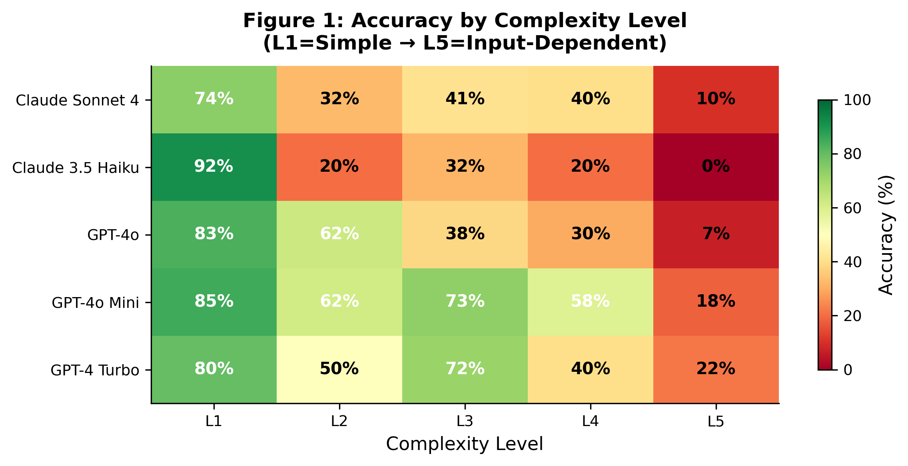
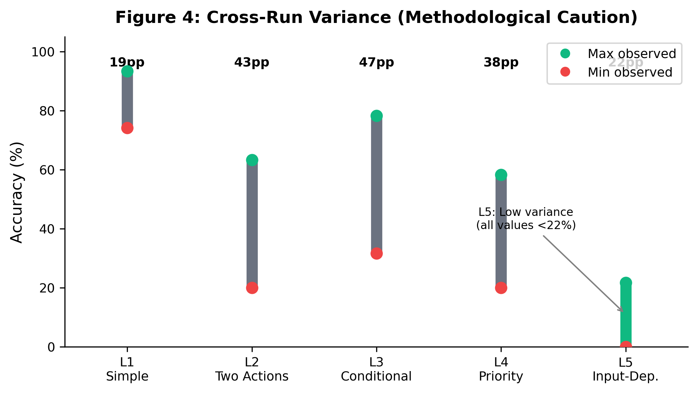
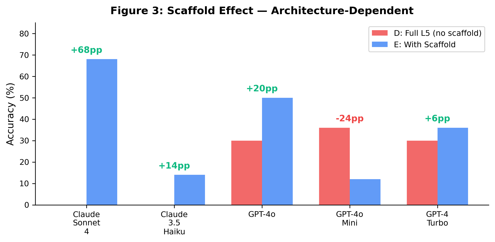
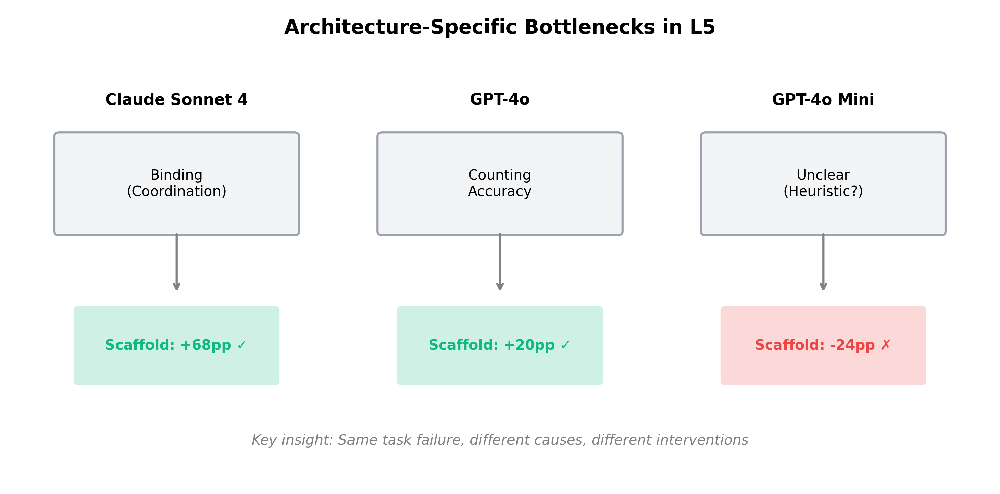

# Arbitrary Rule Following: A Paradigm for Probing Compositional Constraint Satisfaction in Large Language Models

Hillary Danan¹*

¹ Independent Researcher

*Correspondence: hillarydanan@gmail.com

---

## Abstract

Understanding the boundaries of large language model (LLM) capabilities requires tasks that isolate specific cognitive operations from pattern retrieval. We introduce **arbitrary rule following**, a paradigm using procedurally-generated rules from random combinations of conditions and actions to minimize training distribution overlap. Testing six models across two architectures (N=250-600 trials per model), we report three findings. First, input-dependent constraints—rules requiring computation over inputs to determine outputs—are robustly difficult (0-36% accuracy), while fixed constraints show high variance across models and runs (36-94%). Second, the paradigm exhibits substantial measurement instability: identical conditions yield 20-40 percentage point differences across runs, cautioning against single-run LLM evaluations. Third, decomposition of the hardest condition reveals architecture-specific failure modes: Claude models fail at constraint binding but recover with explicit scaffolding (0%→68%), while OpenAI models fail at counting but partially succeed at the composite task (8% counting, 30% composite). These findings demonstrate that (a) input-dependent constraint satisfaction is a reliable difficulty frontier, (b) LLM benchmarks require replication, and (c) composite task failures decompose into distinct bottlenecks across architectures.

---

## Introduction

The question of what large language models can and cannot do remains partially unresolved. Benchmark performance has improved dramatically, yet models continue to fail on tasks that appear simple—suggesting that high performance may reflect training distribution coverage rather than general capability (Lake & Baroni, 2018; Dziri et al., 2023).

A core challenge is **training contamination**: any natural language benchmark may overlap with training data, making it impossible to distinguish genuine generalization from sophisticated retrieval. This confound is particularly acute for compositional generalization—the ability to combine known components in novel ways (Fodor & Pylyshyn, 1988). A model might appear to compose when it actually retrieves similar patterns.

We developed the **arbitrary rule following** paradigm to address this limitation. Rules are procedurally generated from random combinations of conditions (e.g., "if the prompt contains the letter 'k'") and actions (e.g., "respond in exactly 7 words"). These combinations are semantically arbitrary—serving no communicative purpose—and unlikely to exist in training corpora. Success requires parsing rule structure and applying it to novel inputs, not retrieving learned patterns.

Our initial motivation was to study abstraction and compositional reasoning in LLMs. We designed a hierarchy of rule complexity levels to test whether models could handle increasingly structured constraints. What we found was more nuanced: not a clean hierarchy of difficulty, but a specific failure frontier (input-dependent constraints) and substantial measurement instability that raises methodological concerns for LLM evaluation generally.

This paper reports: (1) the paradigm and its rationale, (2) multi-model results revealing what is robust versus unstable, and (3) decomposition analysis showing that composite task failure has architecture-specific causes.

---

## Results

### The Arbitrary Rule Following Paradigm

Rules are generated procedurally from two component pools:

**Conditions** (9 types): letter_contains, letter_starts, letter_ends, word_count_parity, char_count_threshold, vowel_count_threshold, word_position_letter, contains_word, char_position

**Actions** (8 types): prepend, append, all_caps, all_lower, word_limit, include_count, include_symbol, reverse_first_word

These combine into five complexity levels:

| Level | Structure | Example |
|-------|-----------|---------|
| L1 | Single unconditional action | "Always begin with 'QUACK'" |
| L2 | Two simultaneous actions | "Use ALL CAPS and end with '!!'" |
| L3 | IF-ELSE conditional | "If prompt contains 'the', prepend 'YES'; else append 'NO'" |
| L4 | IF-ELIF-ELSE chain | Three conditions with priority ordering |
| L5 | Input-dependent constraint | "Respond in N words where N = vowels in prompt" |

Rules are embedded in system prompts. Test prompts are neutral questions (e.g., "What color is the sky?") to isolate rule-following from content generation. Compliance is evaluated programmatically.

### Multi-Model Results: What Replicates

We tested five models from two providers across two runs (initial: 60 trials/level; replication: 120 trials/level).

*Figure 1: Accuracy heatmap showing degradation from L1 (simple) to L5 (input-dependent). L5 is robustly difficult across all models (0-22%).*

**Table 1: Per-Level Accuracy**

| Model | L1 | L2 | L3 | L4 | L5 |
|-------|-----|-----|-----|-----|-----|
| Claude Sonnet 4 (Run 1) | 93.3% | 41.7% | 41.7% | 35.0% | 8.3% |
| Claude Sonnet 4 (Run 2) | 74.2% | 32.5% | 40.8% | 40.0% | 10.0% |
| GPT-4o (Run 1) | 91.7% | 63.3% | 78.3% | 41.7% | 5.0% |
| GPT-4o (Run 2) | 83.3% | 62.5% | 38.3% | 30.0% | 6.7% |
| GPT-4o Mini | 85.0% | 61.7% | 73.3% | 58.3% | 18.3% |
| GPT-4 Turbo | 80.0% | 50.0% | 71.7% | 40.0% | 21.7% |
| Claude 3.5 Haiku | 91.7% | 20.0% | 31.7% | 20.0% | 0.0% |

**Robust finding**: L5 (input-dependent constraints) is consistently difficult. Across all models and runs, L5 accuracy ranges from 0-22%, with most values under 15%. This finding replicates.

**Unstable finding**: L1-L4 accuracy varies substantially across runs. Claude Sonnet 4 L1 dropped 19 percentage points (93.3%→74.2%); GPT-4o L3 dropped 40 percentage points (78.3%→38.3%). Cross-run variance at L1-L4 ranges from 20-46 percentage points.

**Table 2: Cross-Run Variance by Level**

*Figure 2: Observed accuracy ranges across models and runs. L1-L4 show 19-47pp variance; L5 shows lower variance but all values remain below 22%.*

| Level | Min | Max | Range | Stability |
|-------|-----|-----|-------|-----------|
| L1 | 74.2% | 93.3% | 19.1pp | Unstable |
| L2 | 20.0% | 63.3% | 43.3pp | Very unstable |
| L3 | 31.7% | 78.3% | 46.6pp | Very unstable |
| L4 | 20.0% | 58.3% | 38.3pp | Very unstable |
| L5 | 0.0% | 21.7% | 21.7pp | Moderate (all low) |

The high variance at L1-L4 may reflect: (a) different rules sampled across runs (same seed, different counts), (b) model API updates between runs, (c) inherent stochasticity in generation, or (d) insufficient sample sizes for stable estimation. Regardless of cause, this variance has methodological implications: single-run LLM evaluations on tasks of this type may be unreliable.

### L5 Decomposition: Where Does Input-Dependent Constraint Satisfaction Fail?

To understand why L5 is robustly difficult, we decomposed it into component operations:

| Condition | Tests | System Prompt (gist) |
|-----------|-------|---------------------|
| A | Counting only | "Count vowels, report the number" |
| B | Fixed constraint | "Respond in exactly 7 words" |
| C | Count + report | "Say 'VOWELS: N' then respond normally" |
| D | Full L5 | "Respond in N words where N = vowels" |
| E | Scratchpad | "Show counting work, then respond in N words" |

If counting is the bottleneck, A should fail. If constraint satisfaction is the bottleneck, B should fail. If binding (using computed value as constraint) is the bottleneck, A and B should pass but D should fail. If working memory limits prevent binding, E (explicit scaffold) should help.

*Figure 3: L5 decomposition results. Gray bars show component conditions (A, B, C); red bars show full L5 (D); blue bars show scaffold condition (E). Note GPT-4o's 94% on fixed constraint (B) versus 8% on counting (A).*

**Table 3: L5 Decomposition Results (N=50/condition)**

| Model | A (Count) | B (Fixed) | C (Report) | D (Full L5) | E (Scaffold) |
|-------|-----------|-----------|------------|-------------|--------------|
| Claude Sonnet 4 | 34% | 62% | 36% | 0% | **68%** |
| Claude 3.5 Haiku | 14% | 36% | 14% | 0% | 14% |
| GPT-4o | 8% | **94%** | 64% | 30% | 50% |
| GPT-4o Mini | 30% | 78% | 44% | 36% | 12% |
| GPT-4 Turbo | 16% | 78% | 14% | 30% | 36% |

These results reveal architecture-specific failure patterns:

*Figure 4: Scaffold effect comparison (D vs E). Green annotations indicate improvement; red indicates degradation. Claude Sonnet 4 shows dramatic improvement (+68pp); GPT-4o Mini shows degradation (-24pp).*

**Claude Sonnet 4**: Moderate counting (34%), moderate fixed constraint (62%), but zero on full L5. With explicit scaffold, performance jumps to 68%. The bottleneck is **binding**—the model can count and can (sometimes) constrain, but cannot coordinate these operations without explicit intermediate steps.

**GPT-4o**: Poor isolated counting (8%), excellent fixed constraint (94%), yet 30% on full L5. The model succeeds at the composite task more often than at counting alone. With scaffold, improves to 50%. The bottleneck is **counting accuracy**, but the model partially compensates through other means.

**GPT-4o Mini**: Moderate across components, best at full L5 without scaffold (36%), but scaffold **hurts** performance (12%). The bottleneck is unclear; adding structure interferes with whatever heuristics enable partial success.

**Table 4: Architecture-Specific Bottlenecks**

*Figure 5: Summary of architecture-specific bottlenecks. Same task failure manifests differently across model families, requiring different interventions.*

| Model Family | Primary Bottleneck | Scaffold Effect |
|--------------|-------------------|-----------------|
| Claude | Binding (coordination) | Strongly helps |
| GPT-4o | Counting accuracy | Moderately helps |
| GPT-4o Mini | Unclear | Hurts |

The decomposition reveals that "L5 is hard" is not a single phenomenon. Different architectures fail for different reasons, and interventions (scaffolding) have opposite effects across models.

### Supplementary Finding: Counting-Performance Paradox

GPT-4o presents a paradox: 8% accuracy on isolated counting (A), yet 30% on the full L5 task (D) that requires counting. Three explanations are possible:

1. **Heuristic matching**: Response length defaults (~5-7 words) happen to match typical vowel counts (4-9) in our prompts
2. **Context-dependent counting**: Counting accuracy improves when embedded in a larger task
3. **Evaluation artifact**: The isolated counting prompt ("respond with ONLY the number") may be harder to follow than counting within a response

Evidence for explanation 2: GPT-4o achieves 64% on condition C (count + report), far higher than 8% on A. The constraint "respond with only the number" may itself be difficult, inflating apparent counting failure.

---

## Discussion

### Summary of Contributions

We introduce arbitrary rule following as a paradigm for testing compositional constraint satisfaction with minimized training contamination. Three findings emerge:

1. **Input-dependent constraints are robustly hard**: L5 (0-22%) replicates across models and runs as a reliable difficulty frontier.

2. **LLM evaluation exhibits high variance**: 20-40 percentage point differences across runs caution against single-run benchmarks.

3. **Composite task failures decompose differently across architectures**: Claude fails at binding (fixed by scaffold); GPT-4o fails at counting (partially compensated); GPT-4o Mini shows unclear pattern (scaffold hurts).

### Relation to Prior Work

Our findings align with Lake & Baroni's (2018) demonstration that neural models fail at compositional generalization despite in-distribution success. The arbitrary rule paradigm extends this by explicitly minimizing training overlap through procedural generation.

The architecture-specific decomposition findings relate to work on chain-of-thought prompting (Wei et al., 2022). We find that explicit scaffolding dramatically helps some models (Claude: 0%→68%) but hurts others (GPT-4o Mini: 36%→12%). This suggests that chain-of-thought benefits are not universal and may depend on model-specific factors.

The measurement instability we document connects to Schaeffer et al.'s (2023) critique of emergent abilities. If benchmark performance varies by 20-40 points across runs, claims about capability thresholds may be artifacts of sampling variance.

### Methodological Implications

**For LLM evaluation**: Single-run benchmarks on rule-following or constraint-satisfaction tasks may be unreliable. We recommend: (a) multiple runs with different rule samples, (b) reporting ranges rather than point estimates, (c) replication before claiming specific capability levels.

**For capability analysis**: Composite task failure should not be assumed to have uniform causes. Decomposition can reveal architecture-specific bottlenecks, suggesting targeted interventions.

**For benchmark design**: Procedural generation offers a path to reduced training contamination, but introduces measurement variance. The tradeoff between contamination and stability deserves further study.

### Limitations

**Variance source unclear**: We cannot distinguish rule sampling, model updates, or inherent stochasticity as variance causes.

**Counting as bottleneck**: The counting task may conflate counting ability with instruction-following ("respond with ONLY the number"). Alternative counting evaluations might yield different results.

**Sample sizes**: N=50 per condition in decomposition; N=60-120 per level in main experiment. Larger samples would tighten estimates.

**Model coverage**: Two model families (Anthropic, OpenAI). Open-source models might show different patterns.

**Mechanistic opacity**: We identify behavioral bottlenecks but cannot explain underlying mechanisms. Interpretability methods could provide deeper insight.

### Working Hypotheses

The following interpretations are speculative:

*Why is binding hard for Claude?* Binding a computed value to an output constraint may require maintaining information across the input-processing and output-generation phases. If these phases are relatively decoupled in Claude's architecture, explicit scaffolding (which externalizes the intermediate value) provides a workaround.

*Why does scaffold hurt GPT-4o Mini?* The scaffold prompt is longer and more structured. Smaller models may have limited capacity for complex prompts, with additional instructions interfering with simpler heuristics that enable partial success.

*Why is L5 robustly hard?* Input-dependent constraints require: (1) computing over inputs, (2) holding results, (3) using results to constrain outputs. This coordination may exceed effective working memory regardless of architecture. The fact that scaffold helps some models (Claude) but not others (GPT-4o Mini) suggests the coordination can be externalized for some architectures but not all.

These hypotheses are consistent with our data but not uniquely predicted by it.

---

## Methods

### Rule Generation

Rules generated procedurally using Python's random module (seed=42). Condition and action types sampled uniformly. Parameters (letters, thresholds, words) drawn from predefined pools. Full generation code available at repository.

### Complexity Levels

- **L1**: Single unconditional action
- **L2**: Two simultaneous unconditional actions  
- **L3**: IF-ELSE conditional (one action per branch)
- **L4**: IF-ELIF-ELIF-ELSE chain (one action per branch)
- **L5**: Input-dependent constraint (output property = computed input property)

### Evaluation

Programmatic compliance checking:
- **Text insertion**: Case-insensitive substring match
- **Case transformation**: All alphabetic characters verified
- **Word count**: Whitespace-split token count
- **Self-referential**: Output property equals computed input property

### L5 Decomposition Conditions

- **A (Count only)**: "Count vowels, respond with ONLY the number"
- **B (Fixed constraint)**: "Respond in exactly 7 words"
- **C (Count + report)**: "Say 'VOWELS: N' then respond normally"
- **D (Full L5)**: "Respond in N words where N = vowels in prompt"
- **E (Scaffold)**: "Show counting work: 'VOWELS: N', then respond in N words"

### Models Tested

- Claude Sonnet 4, Claude 3.5 Haiku (Anthropic)
- GPT-4o, GPT-4o Mini, GPT-4 Turbo (OpenAI)

All models accessed via official APIs with default temperature.

### Statistical Approach

We report point estimates with sample sizes. Given observed variance, we emphasize ranges and replication over single estimates. No significance tests; we focus on effect magnitudes and replicability.

---

## Data and Code Availability

All code, data, and analysis scripts available at: https://github.com/HillaryDanan/arbitrary-rules

---

## References

Dziri, N., Lu, X., Sclar, M., Li, X. L., Jian, L., Lin, B. Y., ... & Choi, Y. (2023). Faith and fate: Limits of transformers on compositionality. *Advances in Neural Information Processing Systems, 36*.

Fodor, J. A., & Pylyshyn, Z. W. (1988). Connectionism and cognitive architecture: A critical analysis. *Cognition, 28*(1-2), 3-71.

Lake, B., & Baroni, M. (2018). Generalization without systematicity: On the compositional skills of sequence-to-sequence recurrent networks. *International Conference on Machine Learning*, 2873-2882.

Schaeffer, R., Miranda, B., & Koyejo, S. (2023). Are emergent abilities of large language models a mirage? *Advances in Neural Information Processing Systems, 36*.

Wei, J., Wang, X., Schuurmans, D., Bosma, M., Ichter, B., Xia, F., ... & Zhou, D. (2022). Chain-of-thought prompting elicits reasoning in large language models. *Advances in Neural Information Processing Systems, 35*.

---

## Acknowledgments

This work was conducted independently without institutional funding.

---

## Supplementary Information

### Table S1: Full L5 Decomposition Raw Data

| Model | A | B | C | D | E | E_count_acc | E_used_own |
|-------|---|---|---|---|---|-------------|------------|
| Claude Sonnet 4 | 17/50 | 31/50 | 18/50 | 0/50 | 34/50 | 70% | 82% |
| Claude 3.5 Haiku | 7/50 | 18/50 | 7/50 | 0/50 | 7/50 | 20% | 40% |
| GPT-4o | 4/50 | 47/50 | 32/50 | 15/50 | 25/50 | 46% | 96% |
| GPT-4o Mini | 15/50 | 39/50 | 22/50 | 18/50 | 6/50 | 22% | 54% |
| GPT-4 Turbo | 8/50 | 39/50 | 7/50 | 15/50 | 18/50 | 46% | 80% |

E_count_acc = counting accuracy within scaffold condition
E_used_own = rate at which model used its own reported count (regardless of correctness)

### Table S2: Prompts Used in L5 Decomposition

1. "What color is the sky?" (6 vowels)
2. "Name a fruit." (4 vowels)
3. "What do cats eat?" (5 vowels)
4. "Is water wet?" (4 vowels)
5. "How are you today?" (7 vowels)
... [30 total prompts with vowel counts 3-9]

### Table S3: Test-Retest Reliability (Main Experiment)

| Level | Mean Absolute Difference |
|-------|-------------------------|
| L1 | 13.8pp |
| L2 | 9.2pp |
| L3 | 20.4pp |
| L4 | 5.8pp |
| L5 | 1.7pp |

L5 shows highest test-retest reliability (1.7pp), supporting its robustness as primary finding.
